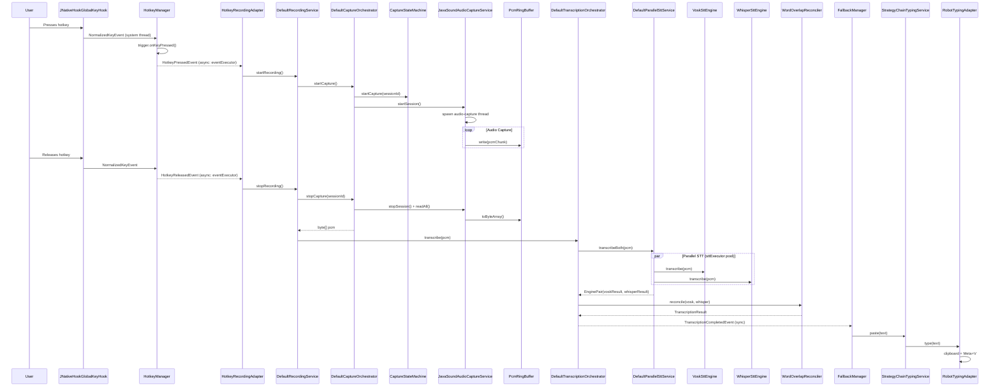
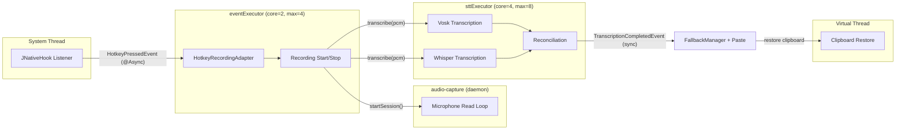

# From Hotkey Press to Typed Text: A Code Walkthrough

This document traces the complete execution flow through actual class names, method calls, and line numbers. Each step identifies the threading model and the Spring event that bridges to the next step.

---

## Sequence Diagram

---

## Step 1: Global Key Event Capture

**Thread:** JNativeHook system thread

| Item | Detail |
|------|--------|
| Class | `JNativeHookGlobalKeyHook` |
| File | `service/hotkey/impl/JNativeHookGlobalKeyHook.java` |
| Entry | `nativeKeyPressed(NativeKeyEvent)` |
| Action | Normalizes key via `KeyNameMapper.normalizeKey()`, extracts modifiers, creates `NormalizedKeyEvent`, calls listener callback |

The listener callback is `HotkeyManager.dispatcher()`, registered during `HotkeyManager.start()`. The dispatch is **synchronous** on the JNativeHook system thread.

---

## Step 2: Hotkey Detection

**Thread:** JNativeHook system thread (still synchronous)

| Item | Detail |
|------|--------|
| Class | `HotkeyManager` |
| File | `service/hotkey/HotkeyManager.java` |
| Entry | `dispatcher()` (line 94) |
| Action | Passes event to `HotkeyTrigger.onKeyPressed()` |

The trigger implementation is selected at startup by `HotkeyTriggerFactory` based on `HotkeyProperties.triggerType`:

| Trigger Type | Class | File |
|-------------|-------|------|
| `DOUBLE_TAP` | `DoubleTapTrigger` | `service/hotkey/trigger/DoubleTapTrigger.java` |
| `MODIFIER_COMBO` | `ModifierCombinationTrigger` | `service/hotkey/trigger/ModifierCombinationTrigger.java` |
| `SINGLE_KEY` | `SingleKeyTrigger` | `service/hotkey/trigger/SingleKeyTrigger.java` |

When the trigger returns `true`, HotkeyManager publishes:

**Event bridge:** `HotkeyPressedEvent` via `ApplicationEventPublisher.publishEvent()` (line 107)

---

## Step 3: Recording Start

**Thread:** `eventExecutor` pool (core=2, max=4, queue=10)

| Item | Detail |
|------|--------|
| Class | `HotkeyRecordingAdapter` |
| File | `service/orchestration/HotkeyRecordingAdapter.java` |
| Entry | `onHotkeyPressed(HotkeyPressedEvent)` (line 48) |
| Annotations | `@EventListener`, `@Async("eventExecutor")` |
| Action | Calls `recordingService.startRecording()` (push-to-talk) or `toggleRecording()` (toggle mode) |

The recording service coordinates state:

| Item | Detail |
|------|--------|
| Class | `DefaultRecordingService` |
| File | `service/orchestration/DefaultRecordingService.java` |
| Entry | `startRecording()` (line 39, synchronized) |
| Action | Validates state via `ApplicationStateTracker`, calls `captureOrchestrator.startCapture()`, transitions to RECORDING |

The capture orchestrator manages the session lifecycle:

| Item | Detail |
|------|--------|
| Class | `DefaultCaptureOrchestrator` |
| File | `service/orchestration/DefaultCaptureOrchestrator.java` |
| Entry | `startCapture()` (line 46) |
| Action | Calls `captureService.startSession()` to get a UUID, registers it in `CaptureStateMachine` |

The state machine provides thread-safe session tracking:

| Item | Detail |
|------|--------|
| Class | `CaptureStateMachine` |
| File | `service/orchestration/CaptureStateMachine.java` |
| Lock | `ReentrantLock` with try/finally |
| States | IDLE (`activeSession == null`) / CAPTURING (`activeSession != null`) |

---

## Step 4: Audio Capture

**Thread:** Dedicated daemon thread `audio-capture`

| Item | Detail |
|------|--------|
| Class | `JavaSoundAudioCaptureService` |
| File | `service/audio/capture/JavaSoundAudioCaptureService.java` |
| Entry | `startSession()` (line 129) spawns `doCapture()` on daemon thread |
| Action | Opens `TargetDataLine` via `DataLineProvider`, reads PCM chunks in a loop |

Each chunk is written to a fixed-capacity ring buffer:

| Item | Detail |
|------|--------|
| Class | `PcmRingBuffer` |
| File | `service/audio/capture/PcmRingBuffer.java` |
| Sync | `synchronized` methods |
| Behavior | Circular overwrite when full; fires `BufferOverflowEvent` callback |

**Event published per chunk:** `PcmChunkCapturedEvent` (used by live caption system)

---

## Step 5: Recording Stop and Audio Retrieval

**Thread:** `eventExecutor` pool

**Event bridge:** `HotkeyReleasedEvent` triggers `HotkeyRecordingAdapter.onHotkeyReleased()` (line 69)

| Item | Detail |
|------|--------|
| Class | `DefaultRecordingService` |
| Entry | `stopRecording()` (line 62) |
| Action | **Inside** synchronized block: calls `captureOrchestrator.stopCapture(sessionId)` to get `byte[] pcm`. **Outside** synchronized block: calls `doTranscribe(pcm)` to avoid blocking hotkey events |

The capture orchestrator stops the audio thread and reads buffered data:

| Step | Method | Detail |
|------|--------|--------|
| Stop capture thread | `JavaSoundAudioCaptureService.stopSession()` | Sets `active.set(false)`, joins capture thread |
| Read audio | `JavaSoundAudioCaptureService.readAll(sessionId)` | Calls `buffer.toByteArray()`, validates via `AudioValidator` |
| Clear state | `CaptureStateMachine.stopCapture(sessionId)` | Atomic session-ID-matched clear |

---

## Step 6: Speech-to-Text Processing

**Thread:** `sttExecutor` pool (core=4, max=8, queue=50)

| Item | Detail |
|------|--------|
| Class | `DefaultTranscriptionOrchestrator` |
| File | `service/orchestration/DefaultTranscriptionOrchestrator.java` |
| Entry | `transcribe(byte[] pcm)` (line 78) |
| Decision | Checks `AudioSilenceDetector` for silence, then routes to single-engine or reconciliation path |

### Single-Engine Path

| Step | Method | Detail |
|------|--------|--------|
| Select engine | `EngineSelectionStrategy.selectEngine()` | Checks watchdog health, picks primary or secondary |
| Transcribe | `engine.transcribe(pcm)` | Runs on calling thread |

### Reconciliation Path (dual-engine)

| Step | Method | Detail |
|------|--------|--------|
| Dispatch | `DefaultReconciliationService.reconcile(pcm)` | Line 57 |
| Parallel STT | `DefaultParallelSttService.transcribeBoth(pcm)` | Two `CompletableFuture.supplyAsync()` on `sttExecutor` |

The two engines run in parallel:

#### Vosk (JNI, in-process)

| Item | Detail |
|------|--------|
| Class | `VoskSttEngine` |
| File | `service/stt/vosk/VoskSttEngine.java` |
| Entry | `transcribe(byte[])` (line 171) |
| Action | Acquires semaphore, creates per-call `Recognizer`, feeds PCM via JNI, parses JSON result |

#### Whisper (subprocess, out-of-process)

| Item | Detail |
|------|--------|
| Class | `WhisperSttEngine` |
| File | `service/stt/whisper/WhisperSttEngine.java` |
| Entry | `transcribe(byte[])` (line 140) |
| Action | Acquires semaphore, writes temp WAV via `WavWriter`, invokes `whisper.cpp` via `WhisperProcessManager`, parses JSON/text output |

---

## Step 7: Reconciliation

**Thread:** `sttExecutor` pool (same thread as dispatch)

| Item | Detail |
|------|--------|
| Class | `WordOverlapReconciler` (default) |
| File | `service/reconcile/impl/WordOverlapReconciler.java` |
| Entry | `reconcile(EngineResult vosk, EngineResult whisper)` |
| Algorithm | Tokenizes both results, computes Jaccard similarity (`|intersection| / |union|`), picks higher-similarity result; if both below threshold, picks longer text |

Available reconcilers (selected via `stt.reconciliation.strategy`):

| Strategy | Class | Selection Logic |
|----------|-------|----------------|
| `OVERLAP` | `WordOverlapReconciler` | Jaccard token similarity |
| `SIMPLE` | `SimplePreferenceReconciler` | Always prefer primary engine |
| `CONFIDENCE` | `ConfidenceReconciler` | Compare confidence scores |

---

## Step 8: Result Publication and Text Delivery

**Thread:** Same as transcription thread (synchronous event delivery)

| Item | Detail |
|------|--------|
| Class | `DefaultTranscriptionOrchestrator` |
| Method | `publishResult()` (line 235) |
| Action | Publishes `TranscriptionCompletedEvent` |

**Event bridge:** `TranscriptionCompletedEvent` (synchronous delivery to all `@EventListener` methods)

Three listeners receive this event:
1. `FallbackManager.onTranscription()` -- delivers text
2. `DefaultRecordingService.onTranscriptionCompleted()` -- transitions state to IDLE
3. `SttEngineWatchdog.onTranscriptionCompleted()` -- records confidence

### Text Delivery

| Item | Detail |
|------|--------|
| Class | `FallbackManager` |
| File | `service/fallback/FallbackManager.java` |
| Entry | `onTranscription(TranscriptionCompletedEvent)` (line 67) |
| Action | Extracts text, calls `typingService.paste(text)` |

### Typing Fallback Chain

| Item | Detail |
|------|--------|
| Class | `StrategyChainTypingService` |
| File | `service/fallback/StrategyChainTypingService.java` |
| Entry | `paste(String text)` (line 54) |
| Action | Tries adapters in order until one succeeds |

| Priority | Adapter | Mechanism |
|----------|---------|-----------|
| 1 | `RobotTypingAdapter` | Sets clipboard, simulates Meta+V (macOS) or Ctrl+V (other) via AWT Robot |
| 2 | `ClipboardTypingAdapter` | Sets clipboard, attempts paste shortcut, restores prior clipboard on virtual thread |
| 3 | `NotifyOnlyAdapter` | Publishes `AllTypingFallbacksFailedEvent` for user notification |

---

## Threading Model Summary

## Spring Events in Order

| # | Event | Publisher | Listener | Async? |
|---|-------|----------|----------|--------|
| 1 | `HotkeyPressedEvent` | `HotkeyManager` | `HotkeyRecordingAdapter` | Yes (`@Async("eventExecutor")`) |
| 2 | `PcmChunkCapturedEvent` | `JavaSoundAudioCaptureService` | Live caption system | Sync |
| 3 | `HotkeyReleasedEvent` | `HotkeyManager` | `HotkeyRecordingAdapter` | Yes (`@Async("eventExecutor")`) |
| 4 | `TranscriptionCompletedEvent` | `DefaultTranscriptionOrchestrator` | `FallbackManager`, `DefaultRecordingService`, `SttEngineWatchdog` | Sync |
| 5 | `TypingFallbackEvent` | `StrategyChainTypingService` | `TypingEventsListener` | Sync |

## Synchronization Mechanisms

| Component | Mechanism | Purpose |
|-----------|-----------|---------|
| `CaptureStateMachine` | `ReentrantLock` | Single active session guard |
| `ApplicationStateTracker` | `volatile` + `synchronized` | State transition validation |
| `DefaultRecordingService` | `synchronized` methods | Session lifecycle serialization |
| `PcmRingBuffer` | `synchronized` methods | Thread-safe circular buffer |
| `AbstractSttEngine` | `ReentrantReadWriteLock` | Concurrent transcription vs exclusive close |
| `VoskSttEngine` / `WhisperSttEngine` | `Semaphore` (via `ConcurrencyGuard`) | Bounded concurrent transcriptions |
| `RestartBudgetTracker` | Per-engine `ReentrantLock` | Restart serialization per engine |
