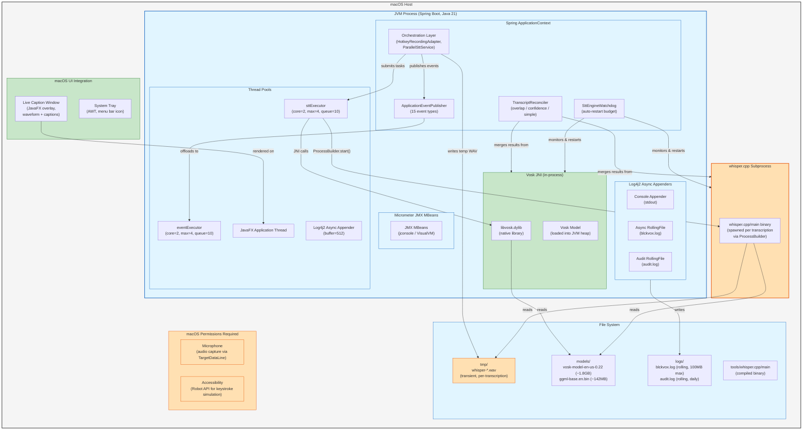
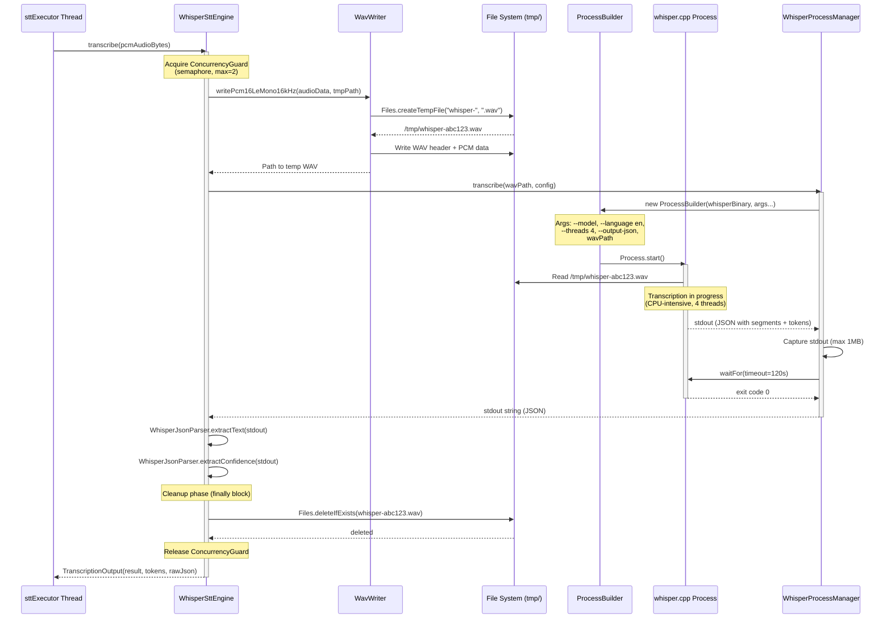

# Deployment Topology

This document describes the runtime deployment structure of blckvox on macOS, including process boundaries, file system layout, resource footprints, and OS-level permissions.

---

## 1. Deployment Topology Diagram

The following C4-style deployment diagram shows all runtime components and their relationships on a macOS host.



### Key Observations

- **Single JVM process**: Everything except whisper.cpp runs in-process, including Vosk (via JNI), the event bus, thread pools, and the JavaFX UI.
- **whisper.cpp is out-of-process**: Spawned per transcription via `ProcessBuilder`. Each invocation is isolated -- a crash in whisper.cpp does not bring down the JVM.
- **Vosk is in-process**: The native library (`libvosk.dylib`) is loaded via JNI. A segfault in Vosk *will* crash the JVM.
- **Thread pools are bounded**: Both `sttExecutor` and `eventExecutor` have configurable core/max/queue sizes to prevent resource exhaustion.
- **Temporary WAV files are transient**: Created before each whisper.cpp invocation, deleted in a `finally` block immediately after.

---

## 2. Whisper Subprocess Interaction Flow

This sequence diagram shows the complete lifecycle of a whisper.cpp subprocess invocation, from WAV file creation to cleanup.



### Subprocess Lifecycle Notes

| Phase | Details |
|-------|---------|
| **WAV Creation** | `Files.createTempFile("whisper-", ".wav")` in system temp directory |
| **Process Spawn** | `ProcessBuilder` with redirected stderr, inherited environment |
| **Stdout Capture** | Bounded to `stt.whisper.max-stdout-bytes` (default 1MB) to prevent OOM |
| **Timeout** | `Process.waitFor(120, TimeUnit.SECONDS)` -- configurable via `stt.whisper.timeout-seconds` |
| **Cleanup** | `Files.deleteIfExists()` in `finally` block -- always runs, even on error |
| **Concurrency** | Semaphore-guarded (default max=2 concurrent whisper processes) |

---

## 3. Resource Footprint Table

| Component | Memory | CPU | Disk |
|-----------|--------|-----|------|
| **JVM + Spring Boot** | ~200MB heap (Xms=512m, Xmx=2g) | idle: <1% | blckvox.jar (~30MB) |
| **Vosk model** | ~1.8GB (loaded into JVM via JNI) | per-transcription: 1 core | 1.8GB on disk |
| **Whisper model** | loaded by subprocess (not JVM heap) | per-transcription: 4 cores (configurable) | 142MB on disk |
| **whisper.cpp process** | ~300MB peak (per instance) | 4 threads default (`stt.whisper.threads`) | temp WAV files (transient) |
| **Log files** | - | - | ~10MB/day (100MB max per file, 30-day retention) |
| **System Tray** | negligible (AWT) | negligible | - |
| **Live Caption Window** | ~20MB (JavaFX scene graph) | negligible when idle | - |
| **Micrometer JMX** | ~5MB (MBean metadata) | negligible | - |

### Peak Resource Budget

| Metric | Typical | Peak (dual-engine, max concurrency) |
|--------|---------|-------------------------------------|
| **Total Memory** | ~2.3GB | ~3.5GB (JVM + Vosk model + 2x whisper.cpp) |
| **CPU Cores** | 1 | 9 (1 Vosk + 2x4 Whisper threads) |
| **Disk (models)** | 1.94GB | 1.94GB (static) |
| **Disk (logs)** | 10MB/day | 100MB max per log file |
| **Open Files** | ~50 | ~200 (launchd limit: 65536) |
| **Subprocesses** | 0-1 | 2 (`stt.concurrency.whisper-max`) |

---

## 4. macOS Permission Requirements

| Permission | Required By | How to Grant | Symptom if Missing |
|------------|-------------|--------------|-------------------|
| **Microphone** | `TargetDataLine` (audio capture) | System Settings > Privacy & Security > Microphone > enable for Java/blckvox | `LineUnavailableException` at capture start |
| **Accessibility** | `java.awt.Robot` (keystroke simulation) | System Settings > Privacy & Security > Accessibility > enable for Java/blckvox | `AWTException: Robot requires Accessibility permissions` |
| **Full Disk Access** | Log files in `/var/log/blckvox/` (production plist) | System Settings > Privacy & Security > Full Disk Access | Permission denied writing logs |

### launchd Deployment (Production)

When deployed as a launchd service via `com.boombapcompile.blckvox.plist`:

| Setting | Value | Purpose |
|---------|-------|---------|
| **RunAtLoad** | `true` | Start on boot |
| **KeepAlive** | `true` | Auto-restart on crash |
| **ThrottleInterval** | 10s | Prevent restart loops |
| **UserName** | `_blckvox` | Non-root service account |
| **Xms / Xmx** | 512m / 2g | JVM heap bounds |
| **GC** | G1GC, MaxPause=200ms | Low-latency garbage collection |
| **HeapDump** | `/var/log/blckvox/heap-dump.hprof` | Post-mortem OOM analysis |

---

## 5. File System Layout

```
/opt/blckvox/                          # Production install root
  blckvox.jar                           # Spring Boot fat JAR
  models/
    vosk-model-en-us-0.22/              # Vosk model directory (~1.8GB)
    ggml-base.en.bin                    # Whisper GGML model (~142MB)
  bin/
    whisper                             # whisper.cpp compiled binary

/etc/blckvox/                          # Production config
  application-production.properties     # Property overrides
  log4j2-production.xml                 # Production logging config

/var/log/blckvox/                      # Production logs
  stdout.log                            # launchd stdout capture
  stderr.log                            # launchd stderr capture
  blckvox.log                           # Application log (rolling)
  audit.log                             # Audit trail (rolling, 365-day retention)
  heap-dump.hprof                       # OOM heap dump (if triggered)

/tmp/                                  # Transient files
  whisper-*.wav                         # Temp WAV files (created and deleted per transcription)
```

### Development Layout

```
speakToMack/                           # Project root
  models/
    vosk-model-en-us-0.22/              # Vosk model
    ggml-base.en.bin                    # Whisper model
  tools/
    whisper.cpp/main                    # whisper.cpp binary
  logs/
    blckvox.log                         # Application log
    audit.log                           # Audit log
```
